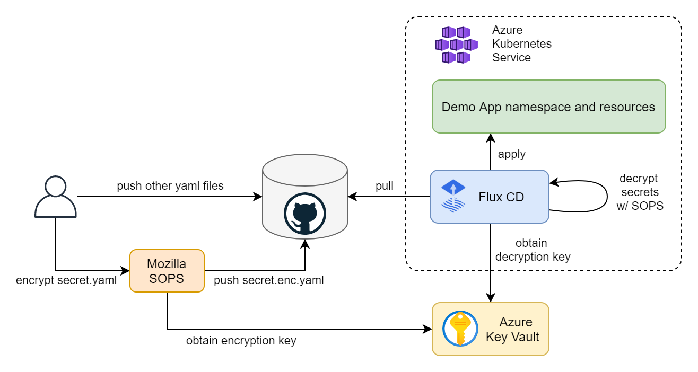
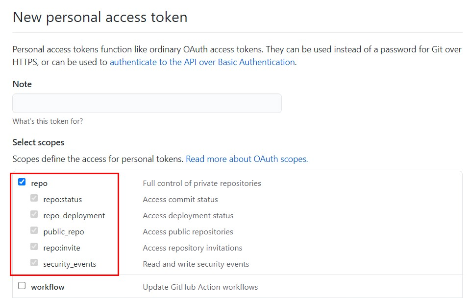
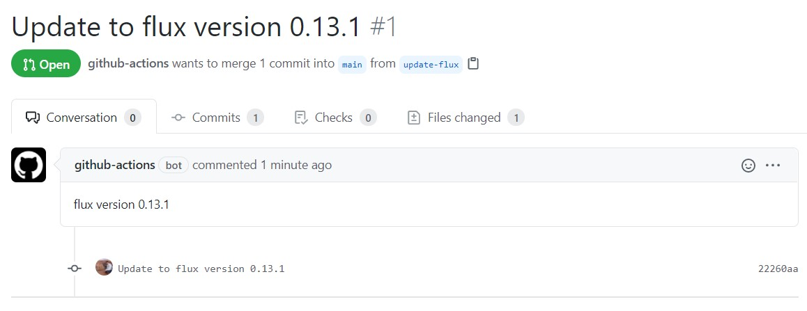

# aks-flux

This repo is intented as a guidance on how to create a GitOps workflow with [Azure Kubernetes Service (AKS)](https://azure.microsoft.com/en-us/services/kubernetes-service/) and [Flux CD](https://github.com/fluxcd/flux2), including secret management with [Mozilla SOPS](https://github.com/mozilla/sops) and [Azure Key Vault](https://azure.microsoft.com/en-us/services/key-vault/).

By following the steps in this repo you are going to learn how to set up a fully automated GitOps workflow where your apps will be automatically deployed when you update their definitions in the repo. First, we will create a cluster in AKS and configure Flux. Then, we will create a sample demo application. And, finally, we will learn how to do secret management in a GitOps way with Mozilla SOPS and Azure Key Vault.



## Create a Kubernetes cluster

First, let's export a few environment variables that will be used throughout the article to create and reference Azure resources. Replace the values with your own names and preferences.

```
export RESOURCE_GROUP_NAME=gitops-demo-rg
export LOCATION=westeurope
export CLUSTER_NAME=GitOpsDemoCluster
```

Create a resource group to contain all the resource that we will create as part of this guide.

```
az group create -n $RESOURCE_GROUP_NAME -l $LOCATION
```

Create an AKS cluster. The command below will create a cluster with the default configuration options, i.e., one node pool with three nodes, a system-assigned identity, kubenet network plugin, no network policy, etc. Feel free to customize the cluster to your needs.

```
az aks create -g $RESOURCE_GROUP_NAME -n $CLUSTER_NAME --enable-managed-identity
```

Once created, obtain the credentials to access the cluster.

```
az aks get-credentials -g $RESOURCE_GROUP_NAME -n $CLUSTER_NAME
```

And check that you are able to interact with it.

```
kubectl get nodes
```

The output should look something like this.

```
NAME                                STATUS   ROLES   AGE     VERSION
aks-nodepool1-30631669-vmss000000   Ready    agent   5m27s   v1.19.9
aks-nodepool1-30631669-vmss000001   Ready    agent   5m30s   v1.19.9
aks-nodepool1-30631669-vmss000002   Ready    agent   5m29s   v1.19.9
```

## Set up Flux CD

Install Flux CD locally.

```
curl -s https://toolkit.fluxcd.io/install.sh | sudo bash
```

Validate Flux pre-requisites.

```
flux check --pre
```

The output should be something like this.

```
► checking prerequisites
✔ kubectl 1.19.7 >=1.18.0-0
✔ Kubernetes 1.19.9 >=1.16.0-0
✔ prerequisites checks passed
```

We are going to connect Flux CD to a GitHub repository, however, you can configure Flux with any other Git repository. Check the [bootstrap section](https://toolkit.fluxcd.io/guides/installation/#bootstrap) of the Flux CD installation guide to learn how to configure Flux with other Git services like Azure Repos.

Create a GitHub repository and clone it locally.

```
git clone git@github.com:adrianmo/gitops-demo.git
cd gitops-demo
```

[Create a GitHub Personal Access Token](https://docs.github.com/en/github/authenticating-to-github/creating-a-personal-access-token) with full access to the repo scope.



Export the token, your GitHub username, and the AKS cluster name.

```
export GITHUB_TOKEN=<your-token>
export GITHUB_USER=<your-username>
export GITHUB_REPO=<name-of-your-repo>
```

Bootstrap the Flux system components.

```
flux bootstrap github \
--owner=$GITHUB_USER \
--repository=$GITHUB_REPO \
--branch=main \
--path=./clusters/$CLUSTER_NAME
```

You should see how Flux starts to install and sync its components and eventually get a confirmation that all components are healthy.

```
► connecting to github.com
► cloning branch "main" from Git repository "https://github.com/adrianmo/gitops-demo.git"
✔ cloned repository
[...]
✔ kustomize-controller: deployment ready
✔ helm-controller: deployment ready
✔ all components are healthy
```

Additionally, you can run the following command to validate the Flux installation.

```
flux check
```

Output.

```
► checking prerequisites
[...]
► checking controllers
[...]
✔ all checks passed
```

Pull the latest updates published by Flux from the repository.

```
git pull origin main
```

## Set up the application

Now that the Flux system is up and running, let's configure the GitOps for our application called "demoapp".

Since we are using the same repository for both the Flux system and our app, we will create a `Kustomization` referencing the same "flux-system" source, however, you could use different repositories for Flux and your app. Check the Flux CD [getting started guide](https://toolkit.fluxcd.io/get-started/#add-podinfo-repository-to-flux) for more information about creating additional repository sources.

```
flux create kustomization demoapp \
  --namespace=flux-system \
  --source=flux-system \
  --path="./manifests" \
  --prune=true \
  --validation=client \
  --interval=5m \
  --export > ./clusters/$CLUSTER_NAME/demoapp-kustomization.yaml
```

We are telling Flux that our app manifests are defined in `./manifests`, and Flux is going to keep that directory in sync with the cluster as soon as we make any changes to the app manifests.

Let's create some manifests to give Flux something to apply.

Create the `manifests` directory.

```
mkdir manifests
```

Create the namespace definition.

```yaml
cat > ./manifests/namespace.yaml <<EOF
---
apiVersion: v1
kind: Namespace
metadata:
  name: demoapp
EOF
```

The deployment.

```yaml
cat > ./manifests/deployment.yaml <<EOF
---
apiVersion: apps/v1
kind: Deployment
metadata:
  name: demoapp
  namespace: demoapp
spec:
  replicas: 2
  selector:
    matchLabels:
      app: demoapp
  template:
    metadata:
      labels:
        app: demoapp
    spec:
      containers:
        - name: demoapp
          image: "mcr.microsoft.com/dotnet/core/samples:aspnetapp"
          ports:
            - containerPort: 80
              protocol: TCP
EOF
```

And the service.

```yaml
cat > ./manifests/service.yaml <<EOF
---
apiVersion: v1
kind: Service
metadata:
  name: demoapp
  namespace: demoapp
spec:
  type: ClusterIP
  selector:
    app: demoapp
  ports:
    - protocol: TCP
      port: 80
      targetPort: 80
EOF
```

After a few moments you should see how your `Kustomization` has been applied the latest commit.

```
kubectl get kustomization -A
```
```
NAMESPACE     NAME          READY   STATUS                                                            AGE
flux-system   demoapp       True    Applied revision: main/a5f6b27feca2e1009afb474adc84c95c972018ad   10m
flux-system   flux-system   True    Applied revision: main/a5f6b27feca2e1009afb474adc84c95c972018ad   58m
```

And our app gets automatically deployed.

```
kubectl -n demoapp get pod,deploy,svc
```
```
NAME                           READY   STATUS    RESTARTS   AGE
pod/demoapp-6b757bbc47-bx7rx   1/1     Running   0          1m
pod/demoapp-6b757bbc47-rh4db   1/1     Running   0          1m

NAME                      READY   UP-TO-DATE   AVAILABLE   AGE
deployment.apps/demoapp   2/2     2            2           1m

NAME              TYPE           CLUSTER-IP    EXTERNAL-IP      PORT(S)        AGE
service/demoapp   LoadBalancer   10.0.252.90   51.144.185.175   80:31122/TCP   1m
```

## Secret management

At this point Flux will apply any manifest we commit to the repo under the `manifests` folder. That will be fine for every Kubernetes resource except for Secrets, which we do not want to disclose and source control their plain values.

A solution for this would be using the [Azure Key Vault Provider for Secrets Store CSI Driver](https://github.com/Azure/secrets-store-csi-driver-provider-azure), which allows us to define our secrets in Key Vault and automatically make them available as Kubernetes secrets. However, this approach breaks our the GitOps workflow where the Git repository is the single source of truth for our application desired state.

A popular GitOps approach for secret management is using Bitnami's [Sealed Secrets](https://github.com/bitnami-labs/sealed-secrets). Sealed Secrets require an additional controller and a new `SealedSecret` CRD that is safe to store in a Git repository. After Flux applies the `SealedSecret` object, their controller decrypts the sealed secret and applies the plain secrets.

Another popular approach for managing secrets in Flux is using Mozilla's [SOPS](https://github.com/mozilla/sops). Unlike Sealed Secrets, SOPS does not require us to deploy any additional controller because Flux's kustomize-controller can perform the decryption of the secrets. Moreover, SOPS has integration with Azure Key Vault to store the cryptographic used to encrypt and decrypt secrets. Therefore, making it an ideal option for managing secrets in Azure.

To configure secret management with Mozilla SOPS and Azure Key Vault we have to create a few resources first.

### Install AAD Pod Identity

[AAD Pod Identity](https://github.com/Azure/aad-pod-identity) enables Kubernetes applications to access Azure resources securely with Azure Active Directory. It will allow us to bind a Managed Identity to Flux's kustomize-controller.

Before installing AAD Pod Identity, we need to give the AKS Kubelet identity permissions to attach identities to the AKS nodes in the AKS-managed resource group. Let's obtain the relevant IDs.

```
RESOURCE_GROUP_ID=$(az group show -n $RESOURCE_GROUP_NAME -o tsv --query id)
AKS_RESOURCE_GROUP_NAME=$(az aks show -g $RESOURCE_GROUP_NAME -n $CLUSTER_NAME -o tsv --query nodeResourceGroup)
AKS_RESOURCE_GROUP_ID=$(az group show -n $AKS_RESOURCE_GROUP_NAME -o tsv --query id)
KUBELET_CLIENT_ID=$(az aks show -g $RESOURCE_GROUP_NAME -n $CLUSTER_NAME -o tsv --query identityProfile.kubeletidentity.clientId)
```

And create the role assignment granting "Virtual Machine Contributor" permissions.

```
az role assignment create --role "Virtual Machine Contributor" --assignee $KUBELET_CLIENT_ID --scope $AKS_RESOURCE_GROUP_ID
az role assignment create --role "Managed Identity Operator" --assignee $KUBELET_CLIENT_ID --scope $RESOURCE_GROUP_ID
```

We are going to install AAD Pod Identity in a GitOps way, because Flux is also capable of managing Helm charts with the [helm-controller](https://toolkit.fluxcd.io/components/helm/controller/), which is installed by default. Therefore, instead of installing the Helm chart directly from our computer as the AAD Pod Identity documentation indicates, we will create a `HelmRepository` and a `HelmRelease` resource that Flux will apply and keep in sync for us. This will allow us to manage and upgrade AAD Pod Identity from the Git repository.

```yaml
cat > ./manifests/aad-pod-identity.yaml <<EOF
---
apiVersion: v1
kind: Namespace
metadata:
  name: aad-pod-identity
---
apiVersion: source.toolkit.fluxcd.io/v1beta1
kind: HelmRepository
metadata:
  name: aad-pod-identity
  namespace: aad-pod-identity
spec:
  url: https://raw.githubusercontent.com/Azure/aad-pod-identity/master/charts
  interval: 10m
---
apiVersion: helm.toolkit.fluxcd.io/v2beta1
kind: HelmRelease
metadata:
  name: aad-pod-identity
  namespace: aad-pod-identity
spec:
  interval: 5m
  chart:
    spec:
      chart: aad-pod-identity
      version: 4.0.0
      sourceRef:
        kind: HelmRepository
        name: aad-pod-identity
        namespace: aad-pod-identity
      interval: 1m
  values:
    nmi:
      allowNetworkPluginKubenet: true
EOF
```

Commit and push the changes to the repo and AAD Pod Identity will be deployed in a few seconds.

```
kubectl get helmrelease -A
```
```
NAMESPACE          NAME               READY   STATUS                             AGE
aad-pod-identity   aad-pod-identity   True    Release reconciliation succeeded   14m
```

```
kubectl -n aad-pod-identity get pods
```
```
NAME                                   READY   STATUS    RESTARTS   AGE
aad-pod-identity-mic-5c9b5845c-4ktft   1/1     Running   0          14m
aad-pod-identity-mic-5c9b5845c-bskj8   1/1     Running   0          14m
aad-pod-identity-nmi-6h6rl             1/1     Running   0          14m
aad-pod-identity-nmi-76vk5             1/1     Running   0          14m
aad-pod-identity-nmi-tr9bk             1/1     Running   0          14m
```

If your Helm chart is not applied, check the status and logs of the kustomize-controller and helm-controller.

### Create a Managed Identity

The Managed Identity will be used by the Flux kustomize-controller to obtain the cryptographic key from Key Vault and decrypt secrets.

```
az identity create -n SopsDecryptorIdentity -g $RESOURCE_GROUP_NAME -l $LOCATION
```

Obtain the client Id, object Id, and the resource Id of the identity.

```
CLIENT_ID=$(az identity show -n SopsDecryptorIdentity -g $RESOURCE_GROUP_NAME -o tsv --query "clientId")
OBJECT_ID=$(az identity show -n SopsDecryptorIdentity -g $RESOURCE_GROUP_NAME -o tsv --query "principalId")
RESOURCE_ID=$(az identity show -n SopsDecryptorIdentity -g $RESOURCE_GROUP_NAME -o tsv --query "id")
```

### Create a Key Vault

Now it's time to create a Key Vault instance, the cryptographic key and give permissions to our identity.

Create an environment variable with the desired name for your Key Vault resource.

```
export KEY_VAULT_NAME=GitOpsDemoKeyVault
```

Create a Key Vault instance.

```
az keyvault create --name $KEY_VAULT_NAME --resource-group $RESOURCE_GROUP_NAME --location $LOCATION
```

Create the cryptographic key.

```
az keyvault key create --name sops-key --vault-name $KEY_VAULT_NAME --protection software --ops encrypt decrypt
```

Add an access policy for the identity.

```
az keyvault set-policy --name $KEY_VAULT_NAME --resource-group $RESOURCE_GROUP_NAME --object-id $OBJECT_ID --key-permissions encrypt decrypt
```

Obtain the key ID and save it for later.

```
az keyvault key show --name sops-key --vault-name $KEY_VAULT_NAME --query key.kid
```

The key ID will have a the following form.

```
https://gitopsdemokeyvault.vault.azure.net/keys/sops-key/b7bc85c1a4ef4180be9d1de46725304c
```

### Configure in-cluster secrets decryption

Now let's create the Azure identity and binding to attach the Managed Identity we created previously to the kustomize-controller.

```yaml
cat > ./clusters/$CLUSTER_NAME/sops-identity.yaml <<EOF
---
apiVersion: aadpodidentity.k8s.io/v1
kind: AzureIdentity
metadata:
  name: sops-akv-decryptor
  namespace: flux-system
spec:
  clientID: $CLIENT_ID
  resourceID: $RESOURCE_ID
  type: 0 # user-managed identity
---
apiVersion: aadpodidentity.k8s.io/v1
kind: AzureIdentityBinding
metadata:
  name: sops-akv-decryptor-binding
  namespace: flux-system
spec:
  azureIdentity: sops-akv-decryptor
  selector: sops-akv-decryptor  # kustomize-controller label will match this name
EOF
```

The identity will be bound to the pods that have the "sops-akv-decryptor" label, therefore, we need to patch the kustomize-controller to set such label and allow AAD Pod Identity to bind the identity.

Patch the kustomize-controller Pod template so that the label matches the `AzureIdentity` name. Additionally, the SOPS specific environment variable `AZURE_AUTH_METHOD=msi` to activate the proper auth method within kustomize-controller.

Create a kustomization.

```yaml
cat > ./clusters/$CLUSTER_NAME/flux-system-kustomization.yaml <<EOF
---
apiVersion: kustomize.config.k8s.io/v1beta1
kind: Kustomization
resources:
  - flux-system
patchesStrategicMerge:
  - sops-kustomize-patch.yaml
EOF
```

And a file to patch the Flux system kustomize controller deployment.

```yaml
cat > ./clusters/$CLUSTER_NAME/sops-kustomize-patch.yaml <<EOF
---
apiVersion: apps/v1
kind: Deployment
metadata:
  name: kustomize-controller
  namespace: flux-system
spec:
  template:
    metadata:
      labels:
        aadpodidbinding: sops-akv-decryptor  # match the AzureIdentityBinding selector
    spec:
      containers:
      - name: manager
        env:
        - name: AZURE_AUTH_METHOD
          value: msi
EOF
```

We also have to tell the kustomize-controller that our app Kustomization needs to use SOPS as the decryption provider and therefore be able to decrypt certain fields of our manifests.

Update the kustomization YAML file in `clusters/$CLUSTER_NAME/demoapp-kustomization.yaml` and add the `spec.decryption` block as shown below.

```yaml
---
apiVersion: kustomize.toolkit.fluxcd.io/v1beta1
kind: Kustomization
metadata:
  name: demoapp
  namespace: flux-system
spec:
  interval: 5m0s
  path: ./manifests
  prune: true
  sourceRef:
    kind: GitRepository
    name: flux-system
  validation: client
  decryption:
    provider: sops
```

Apply the changes and check that the identity binding and patching have been applied successfully.

At this point, the kustomize-controller should be able to decrypt files encrypted with SOPS via our Key Vault key.


### Encrypt secrets

Install [SOPS](https://github.com/mozilla/sops) locally following the instructions from their repository. Then create a `.sops.yaml` file to contain the SOPS configuration. We will tell SOPS to encrypt only the `data` and `stringData` blocks of our YAML files. Therefore, only the values of our Kubernetes secrets will be encrypted. If that rule is omitted, SOPS will encrypt all keys in our YAML files, which is not necessary.

Also, we need to tell SOPS to use our Azure Key Vault key to encrypt the files. Before running SOPS make sure you are logged in with a user that has encrypt access to the Key Vault key being used, otherwise the encryption will fail.

```
cat > .sops.yaml <<EOF
creation_rules:
  - path_regex: .*.yaml
    encrypted_regex: ^(data|stringData)$
    azure_keyvault: https://gitopsdemokeyvault.vault.azure.net/keys/sops-key/b7bc85c1a4ef4180be9d1de46725304c
EOF
```

Create a temporary secret file which we won't commit to the repository.

```yaml
cat > ./secret.yaml <<EOF
---
apiVersion: v1
kind: Secret
metadata:
  name: demoapp-credentials
  namespace: demoapp
type: Opaque
stringData:
  username: admin
  password: t0p-S3cr3t
EOF
```

SOPS will use the logged in user in AZ CLI, therefore, make sure the logged in user has "encrypt" and "decrypt" Key Permissions as shown below.


You can also add those permissions with the following commands.

```
SIGNED_IN_USER_OBJECT_ID=$(az ad signed-in-user show -o tsv --query objectId)
az keyvault set-policy --name $KEY_VAULT_NAME --resource-group $RESOURCE_GROUP_NAME --object-id $SIGNED_IN_USER_OBJECT_ID --key-permissions encrypt decrypt
```

And encrypt the secret.

```
sops --encrypt secret.yaml > ./manifests/secret.enc.yaml
```

The encrypted secret at `./manifests/secret.enc.yaml` will have the following look.

```yaml
apiVersion: v1
kind: Secret
metadata:
    name: demoapp-credentials
    namespace: demoapp
type: Opaque
stringData:
    username: ENC[AES256_GCM,data:21q4bo0=,iv:LOLxXQurjQR6cu9heQlZDdmhNgYO6VCBybbQHV6rO0w=,tag:58ep32CDrlCFuuDnD65VEQ==,type:str]
    password: ENC[AES256_GCM,data:oTZDkadQKL45dA==,iv:5VVbXC55xTVwH/n3t5gtKNtlkB3q7t8lW7Jw1czNSL0=,tag:WuqdubjTu6mQN5x1b3zDyw==,type:str]
sops:
    kms: []
    gcp_kms: []
    azure_kv:
        - vault_url: https://gitopsdemokeyvault.vault.azure.net
          name: sops-key
          version: b7bc85c1a4ef4180be9d1de46725304c
          created_at: "2021-04-23T14:22:15Z"
          enc: KuFxRbcge198GU7hwHs078JNd_1EFtvcFqQ6bOLJDYMnWaW0kSbeD4DCxY0jX9MA17Rv3UMKHGfImgEbNfXGGIh7UucLPygpiuUyn9I73ClSQQ4trc4bD2yVkonCMwz5-0MiPVC3muhQpn3KjhThSucOgjhBnqQy_ymwTeUP9PWi1pSp1jc3S2BxQIuKy09-oEakQogU4BRy55219befizYN7EFe8mstSIkvpksqGxKccH6dQum2k-OqsBUH2jkxiVgi5CEU35COy0pNWVJpZGuOaDMkGGqo7lrT4XKEGxtFKvEDxr6bTfjjQafuuxW9-4a9ZtaBkHCKopk55R9dcQ
    hc_vault: []
    age: []
    lastmodified: "2021-04-23T14:22:18Z"
    mac: ENC[AES256_GCM,data:aw5mfREh5xdeiwbchkiiBS96tGuLJnEqme6VdDrPWKV9R0A4ATIM/1+HcbdAzGBXb9TmhO71hZMl3IvmX9DrNA/tvpPwFvLCkDfNhoWXJoXRRv6aRR7AJPlfcXkVMxxYaRDqz+ugAJkZG+5dhYeh1QAmiswjZOXaINEOw3Jf5dI=,iv:p/M2OhPdh2Naxu37Jt7EwiLf9Eb9OgExsmXX3hSUOJQ=,tag:fVqJ2jy++6GxHBPGXZHmHw==,type:str]
    pgp: []
    encrypted_regex: ^(data|stringData)$
    version: 3.7.1
```

We can now delete the plain secret and push the encrypted secret to the repo.

```
rm secret.yaml
git add manifests/secret.enc.yaml
git commit -m "Add encrypted secret"
git push
```

Flux will read the encrypted secret, decrypt it using the identity and the key, and apply it.

```
kubectl describe secret -n demoapp demoapp-credentials
```
```
Name:         demoapp-credentials
Namespace:    demoapp
Labels:       kustomize.toolkit.fluxcd.io/checksum=c7c24c5836c9f935d9ab866ab9e31192bd98268e
              kustomize.toolkit.fluxcd.io/name=demoapp
              kustomize.toolkit.fluxcd.io/namespace=flux-system
Annotations:  <none>

Type:  Opaque

Data
====
password:  10 bytes
username:  5 bytes
```

From this point on, Flux will keep your app up to date with the latest Kubernetes definitions in your repository, including secrets. You can find the code generated by this guide in the [github.com/adrianmo/aks-flux](https://github.com/adrianmo/aks-flux) GitHub repository.

## Next steps

### Automatic image updates

Flux has a couple of optional components called [Image Automation Controllers](https://toolkit.fluxcd.io/components/image/controller/), which can monitor a container registry and detect when new image tags are uploaded. Then, they can automatically update your deployments to roll out an update to the new container image. Check the [official documentation](https://toolkit.fluxcd.io/guides/image-update/) to know more.

### Keep Flux up to date

There are [multiples ways](https://toolkit.fluxcd.io/guides/installation/#upgrade) to keep the Flux components up to date when new versions are released.

Flux's system components are defined in the `./clusters/${CLUSTER_NAME}/flux-system/gotk-components.yaml` manifest file, therefore, if we regenerate that file with a newer version of Flux (i.e. running `flux install --export ./clusters/${CLUSTER_NAME}/flux-system/gotk-components.yaml`), the manifests will be updated with the new container images and configurations and the Flux system running in the cluster will apply those changes and update itself.

The above procedure can be turned into a scheduled CI workflow and create a Pull Request when changes are made to the manifests, giving us the possibility to review and approve the changes before they are applied. An example implementation of this workflow can be found [here](https://github.com/adrianmo/aks-flux/blob/main/.github/workflows/update-flux.yaml).



### Notifications and monitoring

Since there are many operations that happen automatically, it can be become quite challenging to understand what is going on in our cluster. Therefore, it is crucial to know the state of our system at any time, but especially when things go south.

With Flux we can configure [Notifications](https://toolkit.fluxcd.io/guides/notifications/) to forward events to collaboration and messaging apps like Microsoft Teams or Slack, and also to Git repositories in the form of commit statuses.

Flux also comes with a [Monitoring](https://toolkit.fluxcd.io/guides/monitoring/) stack composed of Prometheus, for metric collection, and Grafana dashboards, for displaying the control plane resource usage and reconciliation stats.
